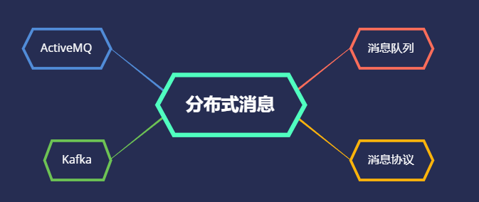

Java5期训练营总结

首先感谢秦老师和各位助教的细心指导，还有各位班主任监督与陪伴，通过这次课程收获满满，不只是技术上的知识，还有很多在软实力，为人处世上的收获，可以看出各位老师将自己所学和感悟倾囊相授，奈何时间有限，没有将课程中学到的知识彻底吸收，不过在此可以将整个训练营的知识脉络脑图展现出来，之后的时间可以以此进行差缺补漏。

## JVM

JVM在面试中一直是热门的题目，不都由于实际工作中几乎用不到相关的知识，导致只是一个记忆的点，本章最大的收获是老师分享的JVM调优经验和GC问题排查案例，以及各种排查工具。

## NIO

以前对NIO只是停留在听说过的阶段，在学习过程中，发现基础知识的欠缺，之后弥补好NIO基础后，再过一遍这里，相信会更有收获

## 并发编程

并发编程在实际工作中用到很多，这个章节带我回顾了一遍所有的并发知识，发现自己还有部分知识点没有完全领悟，特别是Stream的理解，学习到了很多

## Spring 和 ORM 等框架

Spring是最应该重点突击的框架，还需要重点努力

## MySQL 数据库和 SQL

## 分库分表

这部分高级知识，没有实际操作过，公司在底层已经屏蔽了，之后会自己进行尝试

## RPC 和微服务

RPC服务框架，之前只了解过dubbo，但是对底层的逻辑不慎了解，老师带领从头开始搭建RPC框架，对RPC原理理解更加深刻

## 分布式缓存

## 分布式消息队列

